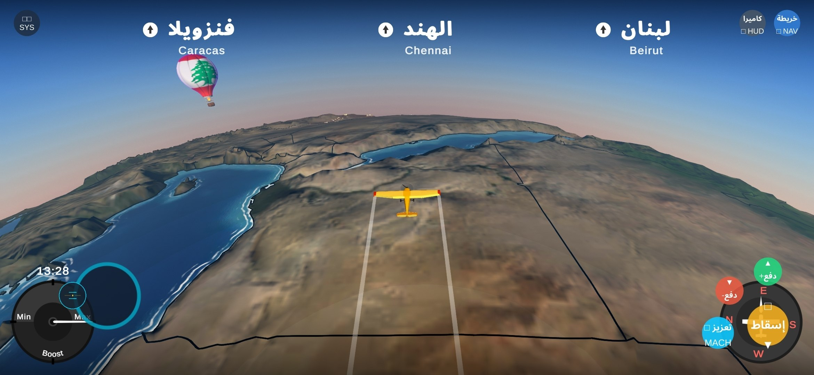
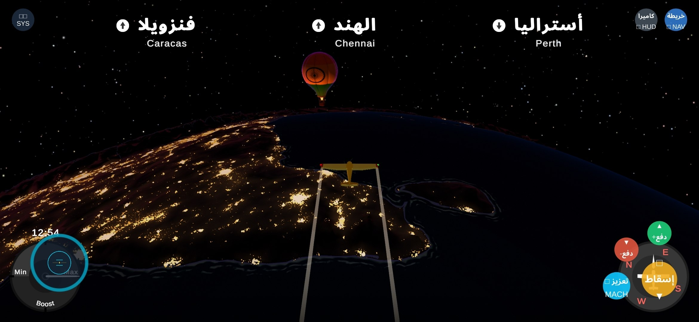
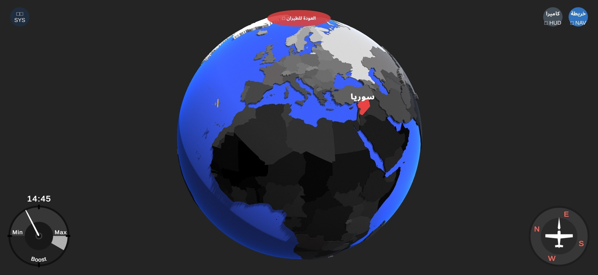
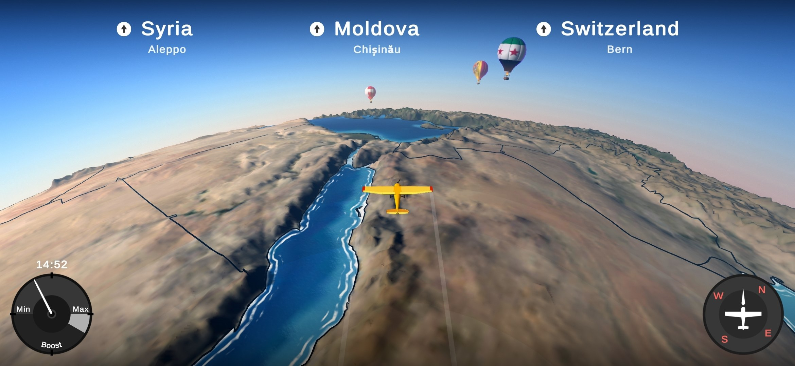

# 🌍✈️ Geographical Adventures

**An immersive low-poly flight simulation and world geography game where you pilot across real-world planetary topography, navigate realistic atmospheric horizons, and deliver packages across nations.**

[📥 Download Latest Release](https://github.com/Mohakerdi/Geographical-Adventures/releases/latest) • [🎮 Features](#-key-features) • [📸 Screenshots](#-gameplay-gallery) • [🕹️ Controls](#-controls--how-to-play) • [👥 Credits](#-credits--acknowledgments)

---

## 📸 Gameplay Gallery

### 🌅 High-Altitude Day Flight
*Delivering packages over realistic continental boundaries and coastal shorelines with active avionics HUD.*

 

### 🌃 Planetary Night Lights & City Constellations
*Soaring above realistic NASA nighttime city lights, star catalogs, and glowing hot air balloons.*

 

### 🌐 3D Interactive Globe Navigation
*Tactical globe view displaying sovereign borders, capitals, quest waypoints, and aircraft trajectory.*

 

### 🏔️ Topological Flight Scenery
*Dynamic terrain generation derived from NASA Visible Earth elevation maps.*

---

## ✨ Key Features

### 📱 Full Mobile & Android Optimization
- **Custom Touch Controls**: Floating responsive virtual steering joystick on the left screen with adaptive touch re-centering.
- **eFootball-Inspired Transient Opacity**: Configurable on-screen button opacity stepper (20% to 100%) in Settings for clean visual immersion.
- **Native Landscape Lock**: Automatically forces comfortable landscape orientation across mobile handsets and tablets.
- **High-FPS Mobile Rendering**: 60+ FPS performance with 2x MSAA, optimized terrain lodding, and smooth sun shadow calculations.

### 🎮 Cockpit Avionics & Tactical HUD
- **Flight-Themed UI**: Procedurally rendered cockpit avionics styling with HUD corner brackets, cyan/amber tactical feedback, and attitude indicator.
- **Day & Night Simulation**: Real-time celestial sun-rotation and atmospheric scattering using authentic NASA Earth Observatory night-light maps.
- **Hot Air Balloon Delivery Quests**: Track country destinations, drop cargo accurately at balloon markers, and learn world geography interactively.

### 🌐 Complete Arabic & Multi-Language Localization
- **Cairo Gaming Typography**: Integrated high-definition `Cairo-Bold` gaming font with dual-tier fallback to ensure 100% Arabic glyph coverage.
- **Multi-Language Support**: Complete translations for Arabic, English, French, Spanish, German, Italian, Portuguese, Dutch, and Slovenian.
- **Accurate World Flags**: Over 200+ sovereign nation flags dynamically rendered on hot air balloons and quest waypoints.

---

## 📥 Download & Play

You can download ready-to-play standalone builds directly from the [GitHub Releases](https://github.com/Mohakerdi/Geographical-Adventures/releases/latest) page:

| Platform | Download File | Instructions |
| :--- | :--- | :--- |
| **Android** 📱 | `Geographical-Adventures.apk` | Download and install the APK on any Android phone or tablet (Android 7.0+). |
| **Windows** 🪟 | `Geographical-Adventures-Windows-x64.zip` | Download, extract the `.zip` archive, and run `Geographical Adventures.exe`. |
| **Linux** 🐧 | `Geographical-Adventures-Linux-Fedora.zip` | Download, extract, and execute `./Geographical Adventures.x86_64`. |

---

## 🕹️ Controls & How to Play

<b>📱 Mobile Touch Controls (Android / Touchscreen)</b>

- **Left Screen**: Touch and drag anywhere to pilot the aircraft with the dynamic floating joystick.
- **Right Screen**:
  - `دفع+` / **Throttle Up**: Increase propeller speed.
  - `دفع-` / **Throttle Down**: Decrease propeller speed.
  - `تعزيز` / **Boost**: Temporary afterburner boost.
  - `إسقاط` / **Drop Package**: Release cargo over the target hot air balloon.
- **Top Bar**:
  - `SYS` / **Pause**: Open Settings and adjust Transient Button Opacity.
  - `خريطة` / **Nav Map**: Toggle 3D Interactive World Globe.
  - `كاميرا` / **Camera**: Cycle between Behind, Cockpit, and Free-look cameras.

<b>⌨️ Desktop Controls (Windows & Linux)</b>

- **Pitch & Roll**: `W` / `S` (Pitch Down/Up), `A` / `D` (Roll Left/Right).
- **Yaw / Rudder**: `Q` / `E`.
- **Throttle**: `Shift` (Increase), `Ctrl` (Decrease).
- **Boost**: `Space`.
- **Drop Package**: `F` or `Enter`.
- **Toggle 3D Map**: `M` or `Tab`.
- **Camera View**: `C`.
- **Pause Menu**: `Escape`.

---

## 👥 Credits & Acknowledgments

- **Mohammad Kerdi** ([@Mohakerdi](https://github.com/Mohakerdi)) - Enhanced Mobile & Multiplatform Port, Arabic Localization & Cairo Typography, Touch HUD & Opacity Engine, GitHub CI/CD Automation.
- **Sebastian Lague** ([@SebLague](https://github.com/SebLague)) - Original Game Concept, 3D Geographic Architecture & Procedural Generation.
- **Geographic Data Sources**:
  - [Natural Earth Data](https://www.naturalearthdata.com/) - Sovereign boundaries and city coordinates.
  - [NASA Visible Earth](https://visibleearth.nasa.gov/) - Continental topography and land surface colors.
  - [NASA Earth Observatory](https://earthobservatory.nasa.gov/) - Nighttime city light telemetry.
  - [Flagpedia](https://flagpedia.net/) - High-resolution sovereign flag database.
  - [HYG Database (Astronexus)](https://github.com/astronexus/HYG-Database) - Stellar position catalog.
- **Music & Sound**: Veaceslav Draganov, Gray North, Jan Baars, The Stolen Orchestra (Artlist / Soundstripe).

---

  Built with ❤️ for geography lovers, aviation enthusiasts, and mobile gamers worldwide.

